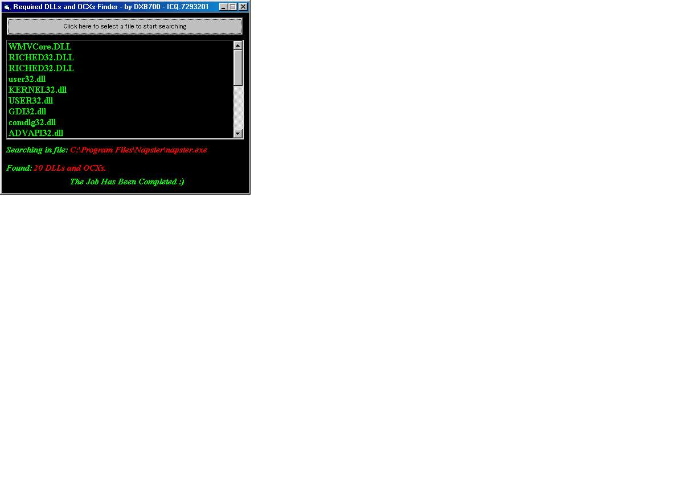



## Find the DLLS and OCXS that are required to open a program

### Description

This program will find all the DLLs and OCXs that a program needs to be opened. for example, the main dlls that are needed for VB 6 apps to be run is MSVBVM60.dll..etc.. There was a previous post in PSC by someome i cant remember his name, but he had many bugs in his prog, and it didn't get all the dlls and ocxs that are needed in some large programs.. this one does it all.. see the screen shot for more info :) please vote if you find it useful. and remember, this is useful when u want to make a setup package and do not know what files to include :)

ICQ 7293201

email strange_life@hotmail.com :)
 
### More Info
 

             |
---                |---
**Submitted On**   |2001-01-05 21:38:54
**By**             |[DXB700](https://github.com/Planet-Source-Code/PSCIndex/blob/master/ByAuthor/dxb700.md)
**Level**          |Intermediate
**User Rating**    |4.7 (151 globes from 32 users)
**Compatibility**  |VB 4\.0 \(32\-bit\), VB 5\.0, VB 6\.0
**Category**       |[Coding Standards](https://github.com/Planet-Source-Code/PSCIndex/blob/master/ByCategory/coding-standards__1-43.md)
**World**          |[Visual Basic](https://github.com/Planet-Source-Code/PSCIndex/blob/master/ByWorld/visual-basic.md)
**Archive File**   |[CODE\_UPLOAD13406152001\.zip](https://github.com/Planet-Source-Code/dxb700-find-the-dlls-and-ocxs-that-are-required-to-open-a-program__1-14152/archive/master.zip)

